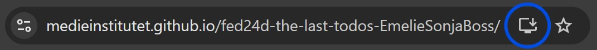

# Packlista

En packlista byggd med React och TypeScript. Appen hjälper dig hålla koll på vad som ska packas inför resan, med möjlighet att organisera saker i kategorier och markera dem som packade. Appen är utvecklad som en Progressive Web App (PWA) vilket betyder att den kan installeras på din enhet och användas offline.

## Funktioner

- Organisera packningslistan i kategorier (t.ex. Hygienartiklar, Kläder, Elektronik)
- Skapa och hantera egna kategorier
- Lägg till saker att packa - med frivilliga beskrivningar
- Markera saker som packade/opackade
- Filtrera mellan packade och opackade saker
- Se antal packade/opackade saker per kategori
- Automatisk sparning i localStorage
- Fungerar offline (PWA)
- Kan installeras som en app på mobil och dator
- Responsiv design som fungerar på alla enheter

## Teknisk Stack

- React 19
- TypeScript
- Vite
- Custom CSS (utan ramverk)
- LocalStorage för persistent data
- Service Workers för PWA-funktionalitet

## Installation

1. Klona repot:
```bash
git clone https://github.com/EmelieSonjaBoss/fed24d-the-last-todos-EmelieSonjaBoss.git
```

2. Installera beroenden:
```bash
npm install
```

3. Starta utvecklingsservern:
```bash
npm run dev
```

## Live Demo & Installation

Besök och installera appen på: [https://emeliesonjaboss.github.io/fed24d-the-last-todos-EmelieSonjaBoss](https://emeliesonjaboss.github.io/fed24d-the-last-todos-EmelieSonjaBoss)



För att installera appen på din enhet:

### På Desktop:
1. Öppna Chrome eller Edge
2. Gå till appens webbadress
3. Klicka på installationsikonen () i adressfältet
4. Följ instruktionerna för installation

### På Mobil (Android):
1. Öppna Chrome
2. Gå till appens webbadress
3. Tryck på "Lägg till på startskärmen"
4. Följ instruktionerna för installation

### På iOS:
1. Öppna Safari
2. Gå till appens webbadress
3. Tryck på dela-ikonen
4. Välj "Lägg till på hemskärmen"
5. Tryck på "Lägg till"

## Projektstruktur

```
src/
  ├── components/           # React-komponenter
  │   ├── PackingList.tsx  # Huvudkomponent för packlistan
  │   ├── PackingItem.tsx  # Komponent för enskilda saker att packa
  │   ├── ItemForm.tsx     # Formulär för att lägga till nya saker
  │   └── CategoryManager.tsx # Hantering av kategorier
  └── styles/              # CSS-filer för varje komponent
```


## Skapad av

Emelie Boss 3/6-2025
